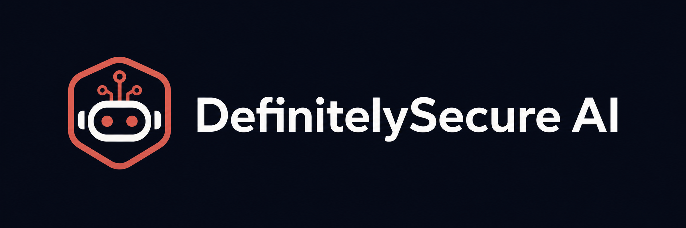

<p align="center">
  
</p>

<h1 align="center">DefinitelySecure AI</h1>

<p align="center">
  Security visibility for modern AI workloads.
</p>

<p align="center">
  <a href="https://definitelysecure.ai">Website</a> •
  <a href="https://definitelysecure.ai/app.html">Platform Demo</a>
</p>

<p align="center">
  
</p>

---

## Overview

DefinitelySecure AI helps teams monitor AI workloads, API activity, and organizational security posture through a centralized platform designed for modern engineering and security teams.

### Key capabilities

- AI workload inventory
- API activity monitoring
- Organizational security dashboard
- Risk and configuration visibility
- Developer API access
- Security event review
- Audit-friendly reporting

## Repository structure

```text
definitelysecure/
├── assets/
│   ├── definitelysecure-logo.png
│   └── definitelysecure-demo.gif
├── app.html
├── index.html
├── .gitignore
└── README.md

# DefinitelySecure AI

**Security visibility for modern AI workloads.**

DefinitelySecure AI gives engineering and security teams a unified view of
their AI applications, API activity, risk posture, and organizational security
controls.

🌐 [definitelysecure.ai](https://definitelysecure.ai)

---

## Overview

As organizations deploy more AI-powered applications, understanding where
models, APIs, credentials, and sensitive workloads are running becomes
increasingly difficult.

DefinitelySecure provides a lightweight platform for monitoring AI workloads
and helping teams maintain visibility across their environment.

### Key capabilities

- AI workload inventory
- API activity monitoring
- Organization security dashboard
- Risk and configuration visibility
- Developer API
- Automated security checks
- Audit-ready activity history

---

## Platform

The DefinitelySecure platform consists of a lightweight web application and
API backend.
                  ┌─────────────────────────┐
                  │   DefinitelySecure AI   │
                  │      Web Platform       │
                  └────────────┬────────────┘
                               │
                               │ HTTPS
                               ▼
                  ┌─────────────────────────┐
                  │       Platform API      │
                  └────────────┬────────────┘
                               │
                 ┌─────────────┴─────────────┐
                 ▼                           ▼
        Workload Metadata              Security Events
